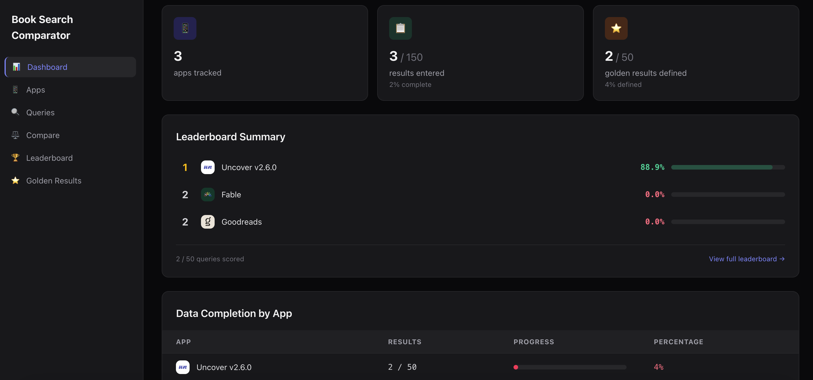
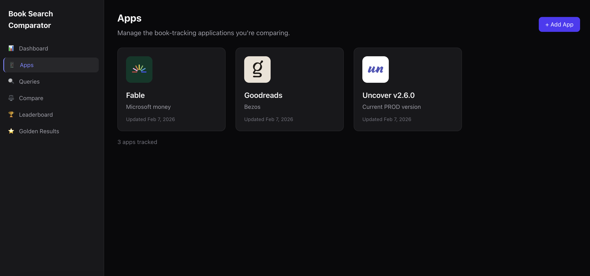
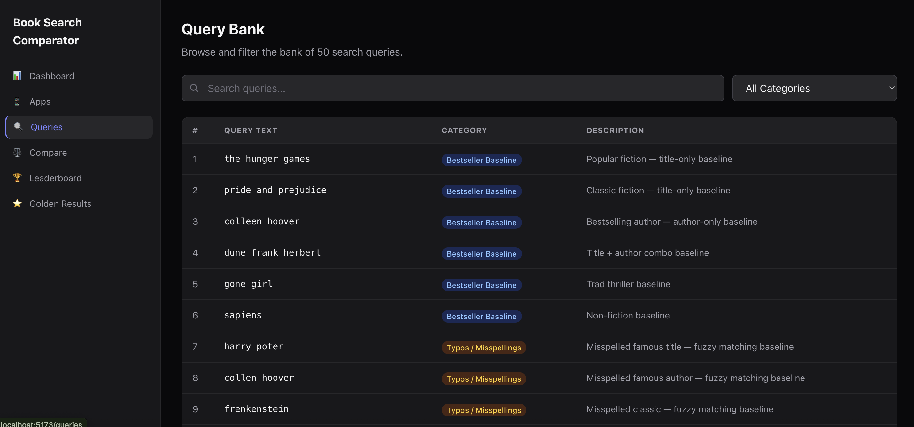
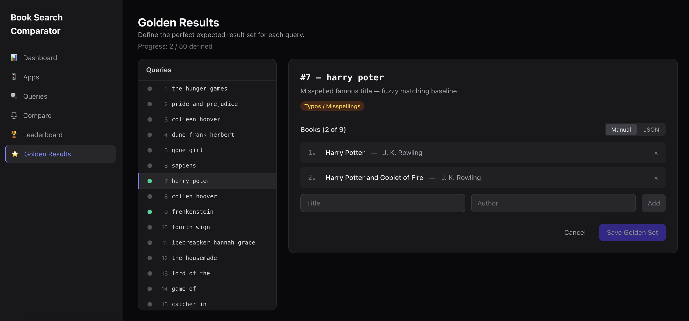
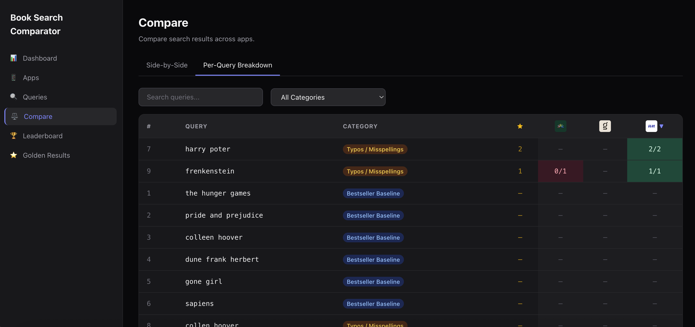
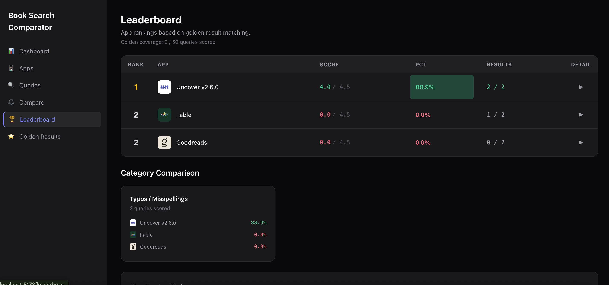

# Book Tracker Search Comparator

A web interface for comparing search results across different book tracking applications (Goodreads, Hardcover, StoryGraph, LibraryThing, Uncover, etc.). Used to learn the baselines and adjust existing search engines to match the market standard.

Built in a single day using a spec-first AI workflow — every feature was designed as a specification document, validated, and then implemented with AI assistance. See the [AI Specification Workflow](#ai-specification-workflow) section for details.

## Screenshots

### Dashboard


### App Management


### Query Bank


### Golden Results Editor


### Comparison Views


### Leaderboard


## Features

- **Dashboard** — At-a-glance stats, leaderboard summary, per-app completion overview, and quick-action links
- **Query Bank** — Browse and filter 50 predefined search queries across 13 categories (Baseline, Typos, Partial, Series, Romance, Thriller, Fantasy/Sci-Fi, Non-English, Translated, Edge Cases)
- **App Management** — Register book tracking apps with logo upload and notes; per-app progress tracking across all 50 queries
- **Results Entry** — Sequential workflow to capture screenshots and ranked book results (title + author) for each query per app
- **Golden Results** — Define the ideal expected results per query (up to 9 books) as ground truth for scoring
- **Comparison Views** — Side-by-Side results with golden-match highlighting, Query Matrix heatmap, and Per-Query Breakdown table
- **Leaderboard** — Ranked scoring based on golden-result matching with per-category breakdowns; accounts for hit rate and position accuracy

## Tech Stack

- **Frontend:** React 19, React Router v7, Tailwind CSS 4 (dark theme)
- **Backend:** Express.js, MongoDB with Mongoose, Multer for file uploads
- **Build:** Vite 7
- **Dev tooling:** ESLint, Concurrently

## Getting Started

### Prerequisites

- Node.js 18+
- MongoDB (for backend mode)

### Install

```bash
npm install
cd server && npm install
```

### Run with Mock API (no database needed)

Set `VITE_USE_MOCK_API=true` in `.env.development`, then:

```bash
npm run dev
```

The mock API provides 5 sample apps, all 50 queries, sample results, and golden data — fully functional in the browser without any backend.

### Run with Backend

1. Start MongoDB locally
2. Create `server/.env`:
   ```
   MONGODB_URI=mongodb://localhost:27017/booktracker-comparator
   PORT=3001
   ```
3. Seed the query bank:
   ```bash
   npm run seed:queries
   ```
4. Start both frontend and backend:
   ```bash
   npm run dev
   ```

The dev server runs Vite (frontend) and Express (backend) concurrently with hot reload.

## Scripts

| Command | Description |
|---|---|
| `npm run dev` | Start Vite + Express server concurrently |
| `npm run build` | Production build to `dist/` |
| `npm run preview` | Preview production build locally |
| `npm run lint` | Run ESLint |
| `npm run seed:queries` | Seed MongoDB with 50 queries |

## Project Structure

```
src/
  pages/          # 10 page components (Dashboard, Apps, Queries, Compare, Golden, Leaderboard, etc.)
  components/     # Reusable components (Sidebar, AppFormModal, comparison views, ScreenshotLightbox)
  api/            # API client layer + mock API with full dataset
  constants/      # Shared constants (categories, colors, view definitions)
  utils/          # Shared utilities (golden match logic)
  layouts/        # AppShell with sidebar

server/
  models/         # Mongoose schemas (Query, App, Result, GoldenResult)
  routes/         # Express route handlers
  scripts/        # Database seed scripts
  data/           # Query dataset (50 queries)

ai-specs/         # Feature specifications (00–09)
```

## AI Specification Workflow

This project was built spec-first. All features have corresponding specifications in `ai-specs/`:

| Spec | Feature |
|---|---|
| 01 | High-Level Architecture |
| 02 | Project Setup & Scaffolding |
| 03 | Query Bank |
| 04 | App Management |
| 05 | Results Entry |
| 06 | Golden Results |
| 07 | Comparison Views |
| 08 | Scoring & Leaderboard |
| 09 | Dashboard |
